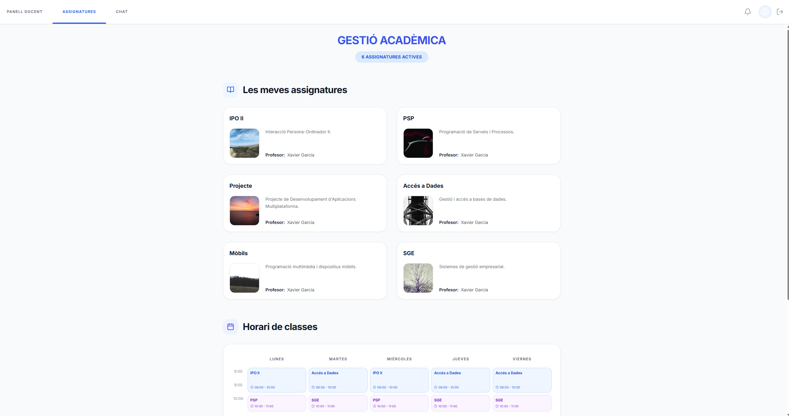
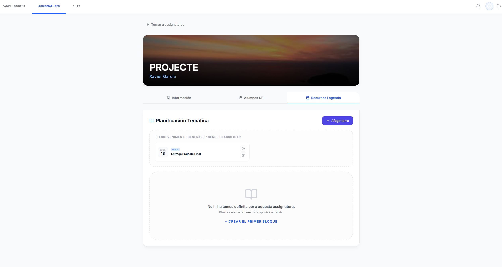

# A — Presentació resum (font)

Aquest fitxer és la font del PDF `resum_2425_EduConnect.pdf`.

## Diapo 1
- Nom del projecte: EduConnect
- Frase descriptiva: La teva plataforma de gestió acadèmica integral.
- Integrants: Arnau Perera Ganuza, Marc Cara Montes
- Curs i cicle: 2n DAM (Desenvolupament d'Aplicacions Multiplataforma)
- Logo escola: INS Pedralbes (TODO afegir imatge a `A-Resum/assets/` i referenciar-la)

## Diapo 2
- Captura significativa del projecte: 

## Diapo 3 (abstract, màx. 10 línies)
EduConnect és una solució integral dissenyada per digitalitzar i optimitzar la comunicació en centres educatius. Mitjançant una interfície intuïtiva, la plataforma unifica la gestió d'horaris dinàmics, el seguiment de tasques i la comunicació centralitzada (Web i Videoconferència). Desenvolupada amb tecnologies modernes com React, Node.js i MongoDB, EduConnect prioritza l'experiència d'usuari i la robustesa del sistema, facilitant la interacció en temps real entre alumnes i professors i assegurant que tota la informació crítica estigui sempre accessible.

## Diapo 4
- Logos de les tecnologies utilitzades: 
    - **Frontend**: React (TypeScript), Vite, TailwindCSS (opcional/Vanilla CSS), Lucide React.
    - **Backend**: Node.js, Express, Socket.io (Real-time).
    - **Base de Dades**: MongoDB (Mongoose), SQL (init.sql).
    - **Integració**: WebRTC (Meet).
    - **Seguretat/Desplegament**: Fail2Ban, Caddy, Docker.

## Ús visual de l’app (captures)
1. **Accés segur**: Interfície de Login moderna i neta.

2. **Gestió del temps**: Horari setmanal dinàmic per a l'alumne.

3. **Edició docent**: El professor pot modificar l'horari en temps real.

4. **Seguiment acadèmic**: Control d'entregues i tasques pendents.

5. **Videoconferència**: Mòdul de Meet integrat per a tutories.

6. **Recursos**: Accés als materials i temaris de cada assignatura.

