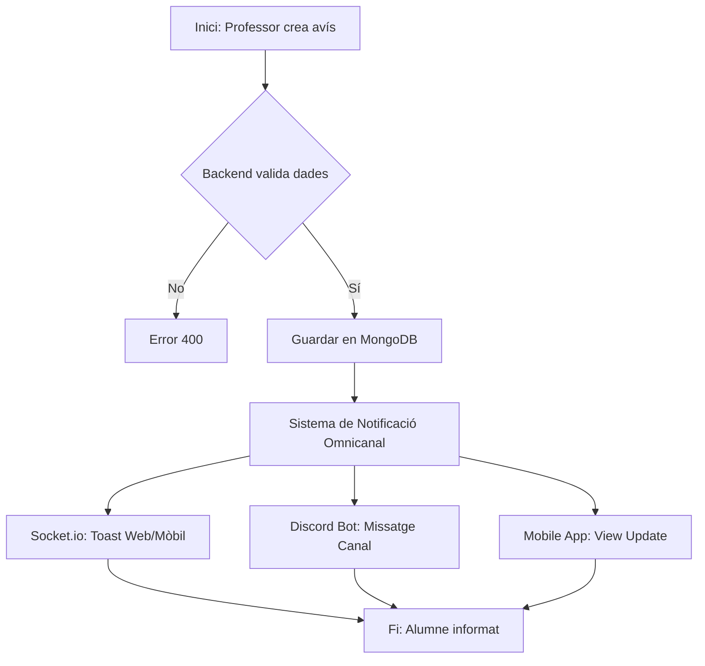

# Diagrama d'Activitats: Flux de Notificacions

Aquest diagrama descriu el procés des que un professor crea una notificació fins que arriba a l'alumne per múltiples canals.

```mermaid
activityDiagram
    start
    :Professor crea avís/examen;
    :Backend rep petició POST;
    if (És vàlid?) then (sí)
        :Backend guarda notificació a DB;
        fork
            :Emissió via Socket.io (Web/Mòbil);
            :Usuari rep Toast instantani;
        fork again
            :Notificació via Discord Bot;
            :Enviament missatge al canal de classe;
        fork again
            :Cua de notificacions per l'App mòbil;
        end fork
    else (no)
        :Retorna error 400;
        stop
    endif
    :Alumne visualitza la notificació;
    stop
```

> Nota: El format `activityDiagram` de Mermaid és conceptual. Utilitzem `flowchart` per a una millor visualització si és necessari.


