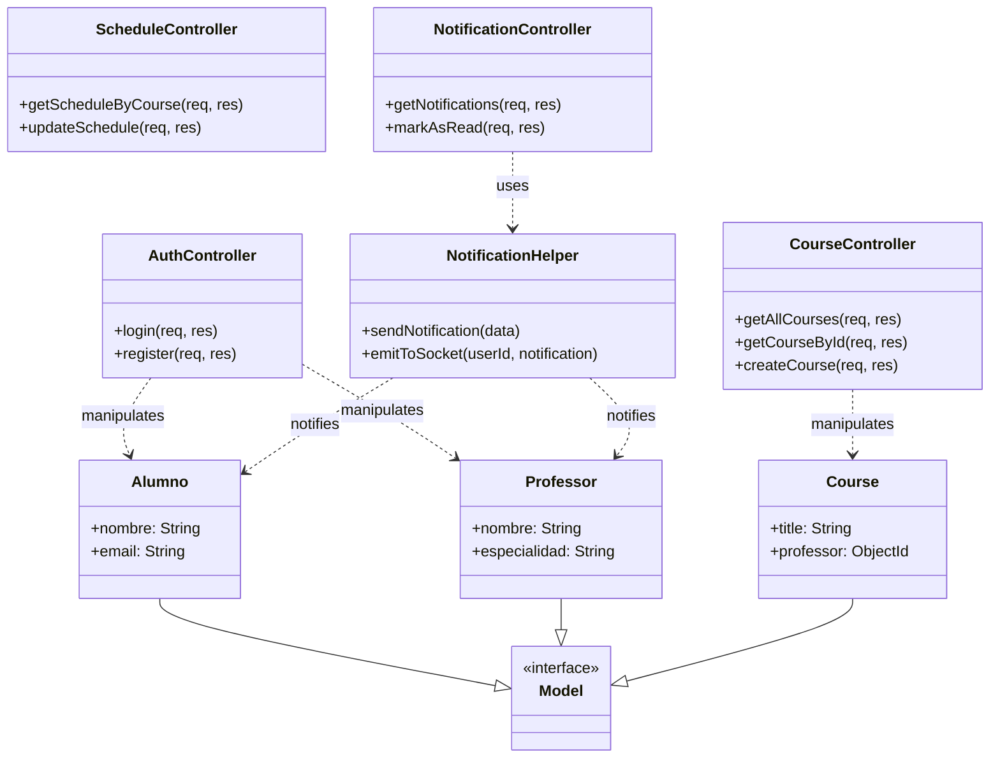

# Diagrama de Classes (Backend)

Aquest diagrama representa l'estructura del backend de l'aplicació, incloent els controladors, models i rutes.

```mermaid
classDiagram
    class AuthController {
        +login(req, res)
        +register(req, res)
    }

    class CourseController {
        +getAllCourses(req, res)
        +getCourseById(req, res)
        +createCourse(req, res)
    }

    class ScheduleController {
        +getScheduleByCourse(req, res)
        +updateSchedule(req, res)
    }

    class NotificationController {
        +getNotifications(req, res)
        +markAsRead(req, res)
    }

    class NotificationHelper {
        +sendNotification(data)
        +emitToSocket(userId, notification)
    }

    class Model {
        <<interface>>
    }

    class Alumno {
        +nombre: String
        +email: String
    }

    class Professor {
        +nombre: String
        +especialidad: String
    }

    class Course {
        +title: String
        +professor: ObjectId
    }

    AuthController ..> Alumno : manipulates
    AuthController ..> Professor : manipulates
    CourseController ..> Course : manipulates
    NotificationController ..> NotificationHelper : uses
    NotificationHelper ..> Alumno : notifies
    NotificationHelper ..> Professor : notifies
    Alumno --|> Model
    Professor --|> Model
    Course --|> Model
```
