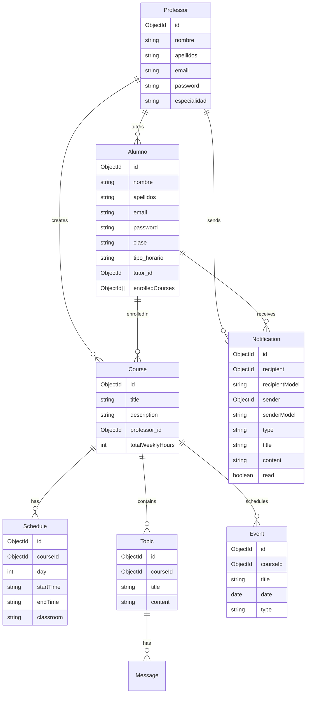

# Diagrama Entitat-Relació (E/R)

Aquest diagrama mostra l'estructura de dades d'EduConnect, representant les col·leccions de MongoDB i les seves relacions lògiques.

```mermaid
erDiagram
    Professor ||--o{ Course : creates
    Professor ||--o{ Notification : sends
    Professor ||--o{ Alumno : tutors
    Alumno ||--o{ Course : enrolledIn
    Alumno ||--o{ Notification : receives
    Course ||--o{ Schedule : has
    Course ||--o{ Topic : contains
    Course ||--o{ Event : schedules
    Topic ||--o{ Message : has

    Professor {
        ObjectId id
        string nombre
        string apellidos
        string email
        string password
        string especialidad
    }

    Alumno {
        ObjectId id
        string nombre
        string apellidos
        string email
        string password
        string clase
        string tipo_horario
        ObjectId tutor_id
        ObjectId[] enrolledCourses
    }

    Course {
        ObjectId id
        string title
        string description
        ObjectId professor_id
        int totalWeeklyHours
    }

    Schedule {
        ObjectId id
        ObjectId courseId
        int day
        string startTime
        string endTime
        string classroom
    }

    Notification {
        ObjectId id
        ObjectId recipient
        string recipientModel
        ObjectId sender
        string senderModel
        string type
        string title
        string content
        boolean read
    }

    Topic {
        ObjectId id
        ObjectId courseId
        string title
        string content
    }

    Event {
        ObjectId id
        ObjectId courseId
        string title
        date date
        string type
    }
```
