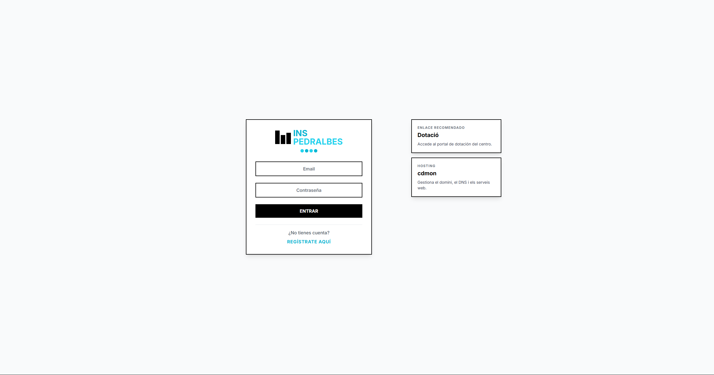
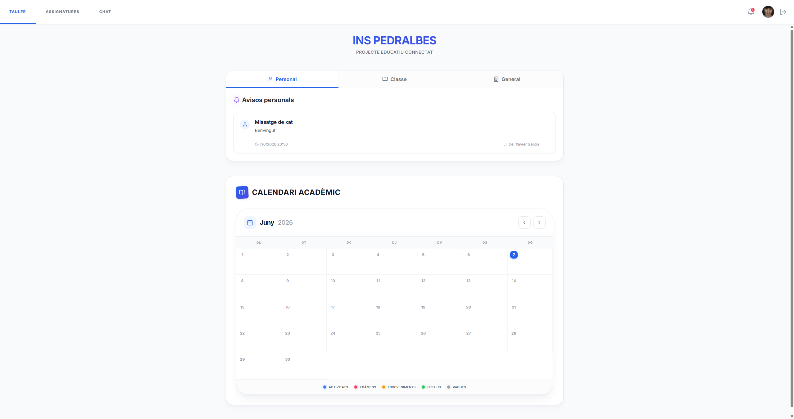
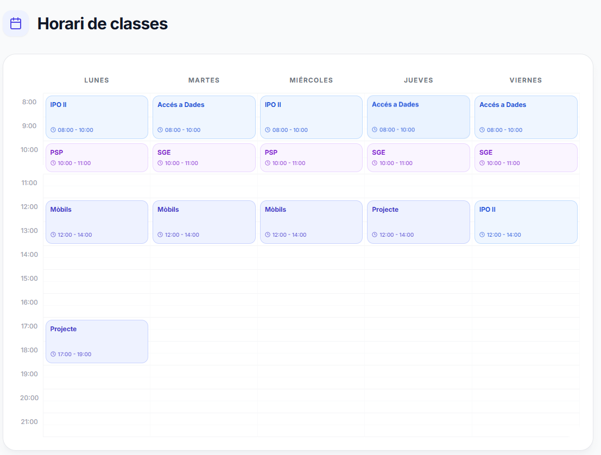
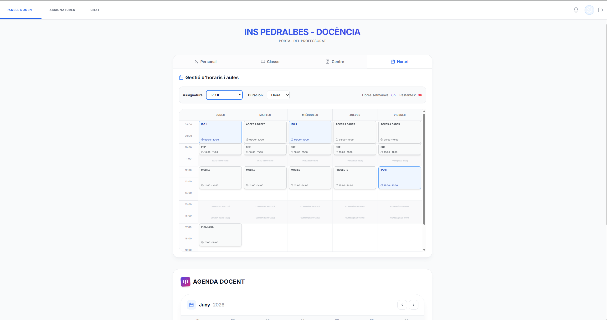
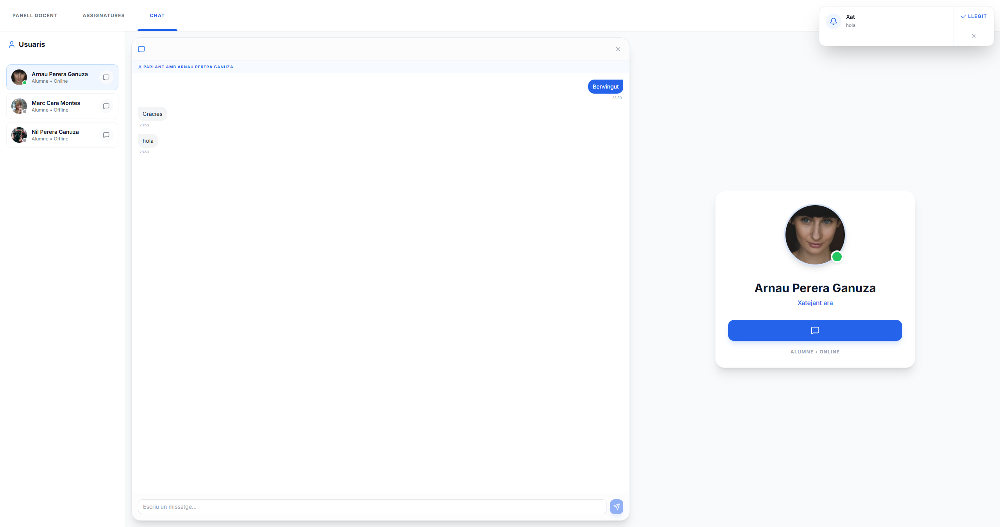

# C — Disseny Visual i Mockups (EduConnect)

Aquest document presenta el disseny final de la interfície d'usuari (UI) d'EduConnect, representant els mockups validats per a la producció. El disseny s'ha centrat en la usabilitat, la claredat visual i la distinció de rols mitjançant el color.

---

## 1. Conceptes de Disseny
*   **Minimalisme:** Interfície neta per evitar la sobrecàrrega cognitiva de l'alumne.
*   **Codi de Colors:** Ús del vermell per a urgències, blau per a informació i verd per a confirmacions (EduBot).
*   **Responsivitat:** Disseny adaptable a escriptori i tauletes per al seu ús a l'aula.

---

## 2. Pantalles Principals (Mockups Finals)

### 2.1 Accés al Sistema (Login)
Disseny simplificat centrat en l'experiència d'entrada única.

### 2.2 Tauló de l'Alumne (Dashboard)
Disseny centralitzat amb el feed d'activitat i el calendari lateral.

### 2.3 Agenda i Gestió Temporal
Disseny de graella horària amb diferenciació cromàtica per assignatura.

### 2.4 Editor Docent
Interfície avançada per a professors amb eines de modificació directa.

### 2.5 Mòdul de Chat
Integració nativa de vídeo P2P dins de l'ecosistema de la plataforma.

---

## 3. Flux de Navegació
Per a una visió detallada del flux de pantalles, consulteu el diagrama corresponent:
*   [Flux de Pantalles (Screen-Flow.md)](./Screen-Flow.md)

---
*EduConnect 2024-25 | Disseny de Producte*
