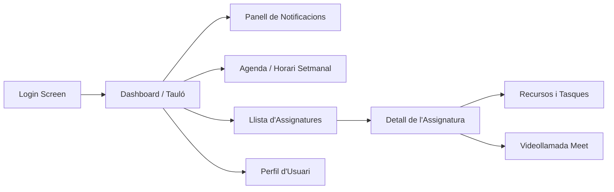
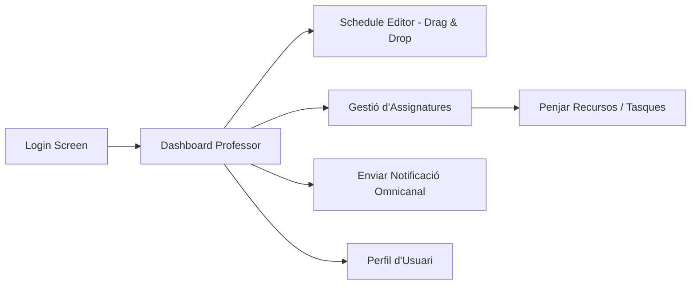

# Flux de Pantalles (UX Flow)

Aquest document detalla la navegació de l'aplicació per als dos rols principals: Alumne i Professor.

## Flux de l'Alumne



## Flux del Professor



## Resum de Navegació
1.  **Login**: Identificació d'usuari i redirecció segons rol.
2.  **Dashboard**: Vista principal amb els avisos de l'EduBot i resum del dia.
3.  **Gestió/Estudi**: Accés als materials d'estudi (alumne) o eines d'edició (professor).
4.  **Comunicació**: Accés directe a Meet i notificacions en temps real.
```
