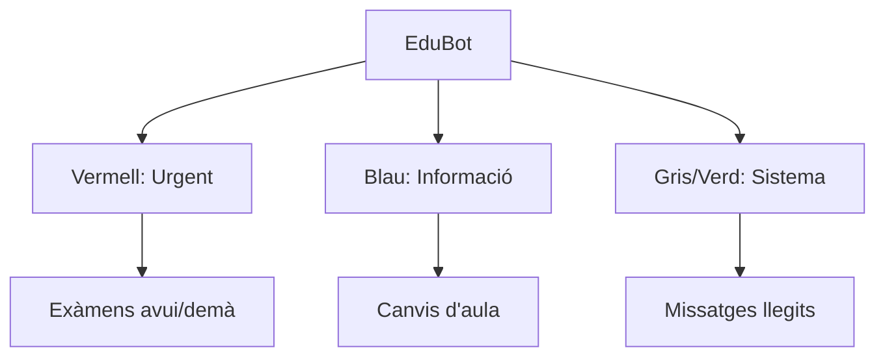

# Manual de benvinguda a la teva nova vida acadèmica amb EduConnect

Hola! Si estàs llegint això, és perquè ja formes part d'EduConnect. Sabem que la vida al centre pot ser intensa: exàmens, entregues, canvis d'última hora... Per això hem creat aquesta plataforma. No és només una web; és el teu nou "company de classe" que t'ajudarà a tenir-ho tot sota control sense estrès.

Anem a fer un volt per les teves eines!

---

## Taula de Continguts
1. [Mirar què hi ha de nou (Dashboard)](#2-mira-què-hi-ha-de-nou-el-tauló)
2. [No arribar tard a classe (Horaris)](#3-organitza-el-teu-temps-agenda-i-horaris)
3. [Eines per a profes (Gestió fàcil)](#4-ets-professor-aquí-tens-el-teu-super-tauler)
4. [Apunts i materials (Recursos)](#5-tot-el-que-necessites-per-estudiar-recursos)
5. [Connectar amb el món (Meet i Discord)](#6-més-enllà-de-la-plataforma-meet-i-discord)

---

## 2. Mira què hi ha de nou: El Tauló
Pensa en el Tauló com la porta de la teva nevera, però plena de coses útils. Aquí apareixerà tot el que realment t'importa:

*   **Personal**: Aquells missatges que només són per a tu. Una resposta d'un profe a un dubte que tenies? Estarà aquí.
*   **La teva Classe**: El dia a dia. Si hi ha un examen a la vista o el profe ha penjat exercicis nous, ho veuràs aquí abans que ningú.
*   **El Centre**: Avisos importants per a tothom. Festius, vagues o esdeveniments especials.

### Coneix a l'EduBot
L'EduBot és el nostre assistent virtual. Mai dorm i t'avisarà al moment perquè no se't passi res. Fixa't en els colors, són com un semàfor:
- **Vermell (Compte!)**: Exàmens o entregues urgents.
- **Blau (Informa't)**: Avisos generals de classe.
- **Gris/Verd (Tot OK)**: Notificacions de sistema o recordatoris tranquils.

### Vista del Tauló i l'EduBot
L'EduBot t'ajudarà a prioritzar la teva feina. Aquesta és la jerarquia d'avisos que veuràs:

---

## 3. Organitza el teu temps: Agenda i Horaris
Sabem que portar l'horari al cap és impossible. Deixa que EduConnect ho faci per tu.

### El teu Calendari
A la dreta de la pantalla tens el teu mapa mensual. Els punts vermells són els exàmens i los blaus són les activitats. Així pots veure de cop d'ull si la setmana serà relaxada o intensa.

### El teu Horari (Sense pèrdues)
Has de canviar de classe i no saps on anar? Consulta l'horari setmanal. T'indicarà l'assignatura, l'aula exacta i el profe que t'espera. Tot actualitzat al minut.

---

## 4. Ets Professor? Aquí tens el teu super-tauler
Hola, profe! Hem dissenyat eines perquè la teva gestió sigui un passeig, no una muntanya de feina extra.

*   **Schedule Editor**: Canviar una classe d'hora ara és tan fàcil com arrossegar un bloc de color.
*   **Adéu a les col·lisions**: Si intentes posar dues classes a la mateixa hora o en una aula ocupada, el sistema et dirà "Eh, un moment!" abans que es creï un embolic. 
*   **Notifica ràpid**: Vols avisar a tots els teus alumnes d'un canvi? Envia un avís des del teu dashboard i els arribarà a la web i al Discord al mateix segon.

---

## 5. Tot el que necessites per estudiar: Recursos
Oblida't de buscar apunts perduts per grups de WhatsApp. A la secció d'Asignaturas ho tens tot organitzat:

*   **Materials**: PDFs, esquemes, fotos... tot llest per descarregar.
*   **Enllaços útils**: Vídeos de YouTube, wikis o eines que el profe ha seleccionat per a tu.
*   **Tasques**: Amb instruccions clares i la data límit ben visible.

---

## 6. Més enllà de la plataforma: Meet i Discord
EduConnect viu on tu vius.

*   **Responsivitat**: Pots accedir des de qualsevol dispositiu. La web s'adapta al teu mòbil o tablet perquè tinguis tota la informació a la butxaca.
*   **Discord**: Si et passes el dia a Discord, l'EduBot et parlarà per allà. Notificacions de classe directament al teu servidor preferit.
*   **Videollamades (Meet)**: No busquis més enllaços a correus antics. Entra a l'assignatura, clica el botó de Meet i ja estàs a dins de la classe virtual. Fàcil, oi?

---

**Pro-tip**: Personalitza el teu perfil amb una foto que t'agradi perquè tothom et pugui reconèixer fàcilment a la comunitat.

Esperem que gaudeixis d'EduConnect. Si tens qualsevol dubte, el teu professor o l'equip de suport estarem encantats d'ajudar-te. Bon curs!
