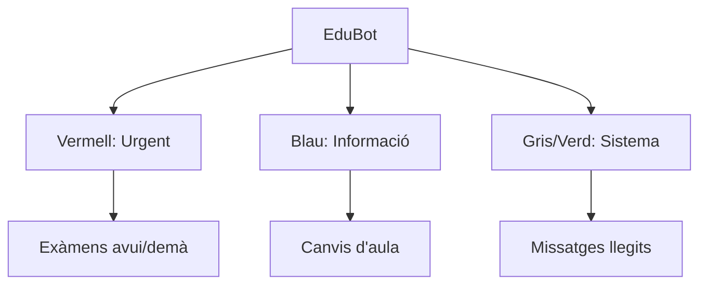

# Manual de benvinguda a la teva nova vida acadèmica amb EduConnect

Hola! Si estàs llegint això, és perquè ja formes part d'EduConnect. Sabem que la vida al centre pot ser intensa: exàmens, entregues, canvis d'última hora... Per això hem creat aquesta plataforma. No és només una web; és el teu nou "company de classe" que t'ajudarà a tenir-ho tot sota control sense estrès.

Anem a fer un volt per les teves eines!

---

## Taula de Continguts
1. [Mirar què hi ha de nou (Dashboard)](#2-mira-què-hi-ha-de-nou-el-tauló)
2. [No arribar tard a classe (Horaris)](#3-organitza-el-teu-temps-agenda-i-horaris)
3. [Eines per a profes (Gestió fàcil)](#4-ets-professor-aquí-tens-el-teu-super-tauler)
4. [Apunts i materials (Recursos)](#5-tot-el-que-necessites-per-estudiar-recursos)
5. [Connectar amb el món (Meet)](#6-més-enllà-de-la-plataforma-meet)

---

## 2. Mira què hi ha de nou: El Tauló
Pensa en el Tauló com la porta de la teva nevera, però plena de coses útils. Aquí apareixerà tot el que realment t'importa:

*   **Personal**: Aquells missatges que només són per a tu. Una resposta d'un profe a un dubte que tenies? Estarà aquí.
*   **La teva Classe**: El dia a dia. Si hi ha un examen a la vista o el profe ha penjat exercicis nous, ho veuràs aquí abans que ningú.
*   **El Centre**: Avisos importants per a tothom. Festius, vagues o esdeveniments especials.

> **[Captura 1: Vista general del Tauló de l'alumne]**

### Coneix a l'EduBot
L'EduBot és el nostre assistent virtual. Mai dorm i t'avisarà al moment perquè no se't passi res. Fixa't en els colors, són com un semàfor:
- **Vermell (Compte!)**: Exàmens o entregues urgents.
- **Blau (Informa't)**: Avisos generals de classe.
- **Gris/Verd (Tot OK)**: Notificacions de sistema o recordatoris tranquils.

> **[Captura 2: Detall de l'EduBot amb notificacions actives]**

### Vista del Tauló i l'EduBot
L'EduBot t'ajudarà a prioritzar la teva feina. Aquesta és la jerarquia d'avisos que veuràs:

---

## 3. Organitza el teu temps: Agenda i Horaris
Sabem que portar l'horari al cap és impossible. Deixa que EduConnect ho faci per tu.

### El teu Calendari
Al lateral del Tauló tens el teu calendari mensual. Els punts de colors t'indiquen què passa cada dia:
- 📝 **Blau**: Activitats i entregues.
- 🎯 **Vermell**: Exàmens (prepara els colzes!).
- 📢 **Groc**: Esdeveniments i avisos.

### Horari Setmanal
A la secció d'Agenda podràs veure el teu horari setmanal. Cada assignatura té el seu color i podràs veure a quina aula t'has de dirigir.

> **[Captura 3: Horari setmanal amb classes programades]**

---

## 4. Ets Professor? Aquí tens el teu súper tauler
Si ets docent, EduConnect et dóna superpoders per gestionar les teves classes en pocs clics.

### Editor d'Horaris
Pots modificar l'horari de l'assignatura simplement arrossegant i deixant anar. El sistema et dirà si t'estàs passant de les hores setmanals permeses.

### Seguiment de Tasques
Saps qui ha entregat la feina i qui no d'un sol cop d'ull. Pots enviar recordatoris massius a aquells que s'han despistat amb un sol botó.

> **[Captura 4: Panell de seguiment d'entregues amb botó de recordatori]**

---

## 5. Tot el que necessites per estudiar: Recursos
Dins de cada assignatura trobaràs el "Temari". Aquí els profes aniran penjant:
- Documents PDF i enllaços.
- Tasques que has d'entregar.
- Avisos específics de la matèria.

**Com entregar una tasca?**
1. Entra a l'assignatura.
2. Busca la tasca (té una icona de llista 📝).
3. Prem "Pujar Entrega" i tria el teu fitxer o escriu el teu comentari.

---

## 6. Més enllà de la plataforma: Meet

### Meet: Videollamades directes
No necessites enllaços externs. Si el profe obre una sessió de Meet, t'apareixerà un avís i podràs entrar directament per parlar cara a cara.

> **[Captura 5: Interfície de Meet dins de l'app]**

---
*EduConnect: Connectant el futur de l'educació.*
